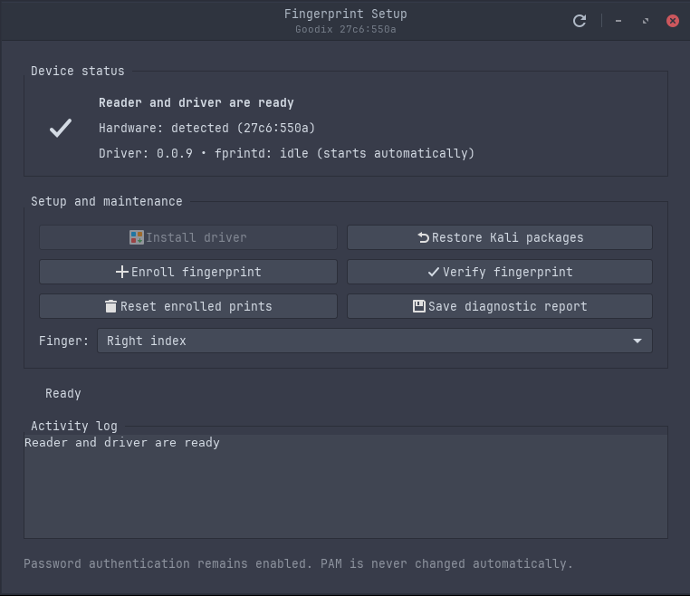

# Lenovo E16 Fingerprint Driver App

[](https://github.com/Gh0stlyKn1ght/lenovo-e16-fingerprint-driver-app/actions/workflows/shell.yml)

A safety-oriented installer for the Goodix MOH fingerprint reader
`27c6:550a`. This project makes Lenovo's proprietary Ubuntu TOD driver usable
on current Kali/Debian systems without redistributing the driver, and provides
a native GTK setup and recovery application.

Created for and initially validated on Kali Linux by
[@Gh0stlyKn1ght](https://github.com/Gh0stlyKn1ght).



## Hardware status

Validated on:

- Lenovo ThinkPad E16 Gen 1 AMD, type `21JT`;
- Goodix MOH fingerprint reader `27c6:550a`;
- Kali Linux Rolling 2026.3, amd64;
- GTK 3 on XFCE/X11;
- driver detection and right-index enrollment confirmed on real hardware.

This project intentionally rejects other USB product IDs. Similar-looking
Goodix readers such as `27c6:55a4` and `27c6:55b4` use different protocols.

Lenovo also ships different fingerprint modules in some configurations of the
same laptop. See the tiered [hardware and distribution compatibility
matrix](docs/SUPPORTED-HARDWARE.md); `27c6:550a` is always the authoritative
check.

## Why this project exists

Upstream libfprint does not support this reader. Lenovo publishes a working
x86-64 TOD plug-in, but current Kali uses the time64 `libgusb2a` package and
standard libfprint without TOD loading. Existing setup scripts install foreign
packages directly, ignore failures, and modify PAM before verifying hardware.

This installer instead:

- accepts only the exact USB ID `27c6:550a` on amd64;
- downloads the proprietary package from Lenovo and verifies its SHA-256;
- verifies Canonical TOD artifacts before use;
- adapts the `libgusb2` dependency metadata to Kali's ABI-compatible
  `libgusb2a` only after checking the shared-library ABI;
- asks APT to simulate the complete transaction first;
- records package state and provides rollback;
- pins the TOD stack against accidental partial upgrades;
- verifies that fprintd sees the device;
- disables runtime autosuspend for `27c6:550a` to prevent mid-enrollment stalls;
- never enables fingerprint PAM automatically;
- provides a native GUI without putting privileged package logic in the UI.

## How it works

1. The preflight checks the exact USB ID, amd64 architecture, distribution,
   installed packages, and Kali's `libgusb2a` runtime.
2. The installer downloads Lenovo's Goodix `0.0.9` TOD module and Canonical's
   TOD-enabled libfprint packages over HTTPS.
3. Every artifact must match a pinned SHA-256 before it is extracted or used.
4. Package metadata is adapted from Ubuntu's `libgusb2` name to Kali's
   ABI-compatible `libgusb2a` only after checking for `libgusb.so.2`.
5. APT simulates the complete transaction. Installation stops if it would
   alter critical login, PAM, sudo, or system packages unexpectedly.
6. A narrow udev override disables runtime autosuspend only for `27c6:550a`.
   This prevents the vendor driver from stalling partway through enrollment.
7. The GUI uses PolicyKit for installation and restoration. Enrollment,
   verification, reset, and diagnostics run as the signed-in user.
8. PAM remains untouched until the user has completed enrollment and
   verification and chooses to enable it manually.

## Security model

- No fingerprint data, proprietary binary, diagnostic report, or hardware
  capture is stored in this repository.
- The application has no telemetry and no upload functionality.
- Templates are stored locally below `/var/lib/fprint/<user>/`, protected by a
  root-owned mode-`0700` state directory.
- `fprintd` is systemd-sandboxed with `NoNewPrivileges`, protected home and
  system paths, and address families restricted to local IPC and netlink. The
  loaded proprietary driver cannot open an Internet socket under this policy.
- The installer only downloads reviewed Lenovo/Canonical artifacts and verifies
  pinned cryptographic hashes. It never uploads files.
- PAM is never enabled automatically. Password authentication and recovery
  remain available.
- Diagnostics omit biometric data, USB serials, and network identifiers.
- Git ignores diagnostics, templates, captures, `.fprint` files, packages, and
  driver binaries.

The Goodix module is proprietary and cannot be audited by this project.
Fingerprint templates should be treated as sensitive and non-revocable. Use
full-disk encryption to protect them against offline access, and use fingerprint
authentication as a convenience factor rather than the only credential. Read
[SECURITY.md](SECURITY.md) for the full threat model.

## Desktop setup utility

The native GTK utility shows live reader and driver status and provides guided
actions for installation, enrollment, verification, resetting enrolled prints,
diagnostics, and restoring Kali packages.

Launch it from the repository:

```sh
./goodix-550a-gui
```

Add it to the current user's application menu:

```sh
./install-desktop.sh
```

Remove the application-menu entry with `./install-desktop.sh --remove`.

The GUI uses the existing audited scripts for privileged operations. A normal
PolicyKit authorization dialog appears when installing or restoring packages.
Enrollment and verification run as the signed-in user. PAM configuration is
never changed by the GUI.

Current GUI requirements are Python 3, PyGObject, GTK 3, PolicyKit, and the
standard `fprintd` command-line clients. These are present by default on the
target Kali XFCE installation.

The interface provides:

- live reader, package, and service status;
- verified driver installation;
- selectable-finger enrollment with cancellation;
- fingerprint verification;
- deletion of enrolled prints;
- sanitized diagnostic export;
- one-click restoration of Kali packages.

## Usage

Clone and inspect the project:

```sh
git clone https://github.com/Gh0stlyKn1ght/lenovo-e16-fingerprint-driver-app.git
cd lenovo-e16-fingerprint-driver-app
```

Inspect the system without changing it:

```sh
./preflight.sh
```

Download, verify, and simulate the transaction:

```sh
sudo ./install.sh --dry-run
```

Install after reviewing the dry run:

```sh
sudo ./install.sh
```

Or launch the GUI and choose **Install driver**:

```sh
./goodix-550a-gui
```

Enroll and verify before enabling PAM:

```sh
fprintd-enroll -f right-index-finger
fprintd-verify
sudo pam-auth-update
```

Restore distribution packages:

```sh
sudo ./uninstall.sh
```

Repair an existing installation that stalls during enrollment:

```sh
sudo ./repair-power.sh
```

Create a sanitized support report:

```sh
./diagnose.sh > diagnostic.txt
```

Review the report before attaching it to an issue. Never share enrolled
templates, biometric captures, passwords, or USB serial numbers.

## Recovery

The GUI's **Restore Kali packages** action and `uninstall.sh` both remove the
proprietary module, TOD package pin, and power override, then reinstall Kali's
distribution versions of libfprint and fprintd. Enrolled templates are retained
unless the user explicitly chooses **Reset enrolled prints**.

Always retain working password access. If a graphical session fails, recovery
can be run from a TTY:

```sh
cd lenovo-e16-fingerprint-driver-app
sudo ./uninstall.sh
```

## Testing

Run the local test suite:

```sh
./tests/test-static.sh
```

CI performs shell syntax and policy tests, Python backend unit tests, Python
compilation, and ShellCheck. The installer also has its own real-system
`--dry-run` transaction check.

## Licensing

The installer code is MIT licensed. Goodix's module is proprietary and is not
part of this repository. Lenovo's official archive is fetched at install time.
Canonical's TOD-enabled libfprint packages remain under their respective
licenses. See `SECURITY.md` before using fingerprint authentication.

## Upstream references

- Lenovo package DS560884 / `r1slg01w.zip`
- freedesktop.org libfprint
- Ubuntu's TOD-enabled libfprint packages
- `linux-fingerprint-drivers` device entry for `27c6:550a`

## Credits

Project creation, Kali compatibility direction, and target-hardware validation:
[@Gh0stlyKn1ght](https://github.com/Gh0stlyKn1ght).

See [CONTRIBUTORS.md](CONTRIBUTORS.md) for upstream and community attribution.
